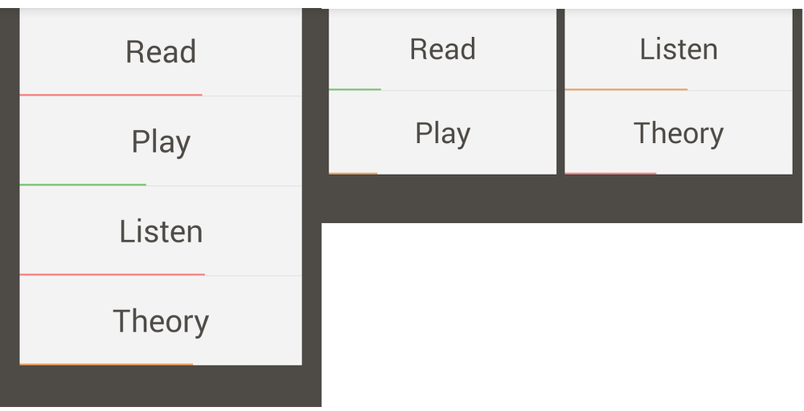

AndroidListSplitter
===================

A custom view library that enables ExpandableListViews to be split automatically between orientation changes.

You can convert between any number of list views by simply extending the ExpandableListSplitter and ExpandableListSplitterAdapter.  You only need one instance of each, and the AndroidListSplitter will do the rest of the work.

LICENSE

Copyright [yyyy] [name of copyright owner]

Licensed under the Apache License, Version 2.0 (the "License");
you may not use this file except in compliance with the License.
You may obtain a copy of the License at

    http://www.apache.org/licenses/LICENSE-2.0

Unless required by applicable law or agreed to in writing, software
distributed under the License is distributed on an "AS IS" BASIS,
WITHOUT WARRANTIES OR CONDITIONS OF ANY KIND, either express or implied.
See the License for the specific language governing permissions and
limitations under the License.