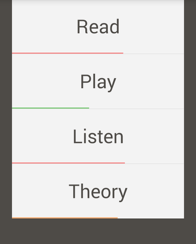
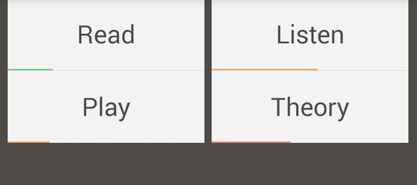

AndroidListSplitter
===================

A custom view library that enables ExpandableListViews to be split automatically between orientation changes.

You can convert between any number of by simply extending the ExpandableListSplitter and ExpandableListSplitterAdapter.
